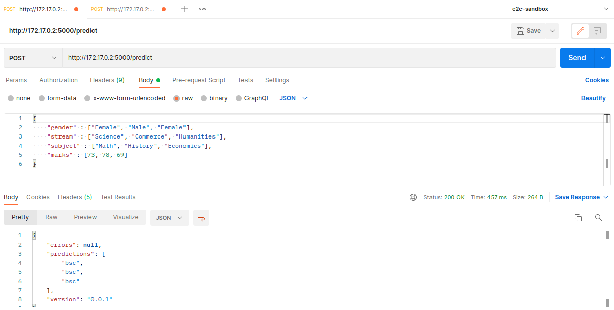
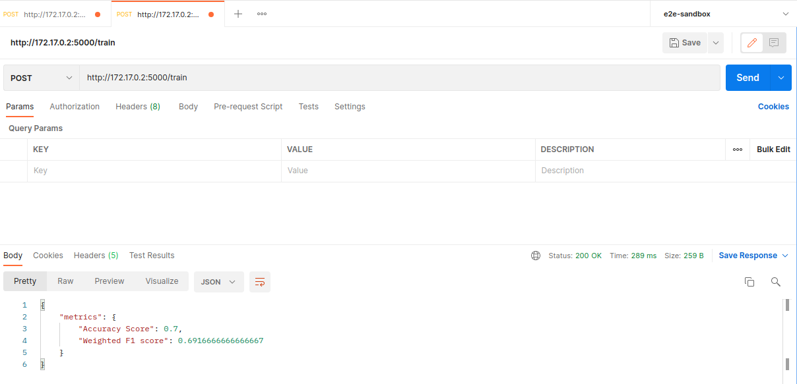

# Alef Course Recommender Engine
Technical test for Alef Lead MLE

## Dataset
The dataset contains 5 columns and the last column is the target variable.
● Gender
● Stream
● Subject
● Marks
● Course

The dataset is present at ./src/dataset/train.csv

## Model
The trained model is persisted at .src/models/course_recommender_model_file_v0.0.1.pkl

## Python code
The python for the developed functionalities are present at .src/modules/*

## Test-cases
All of the test-cases are present under the ./test/ folder. The test-cases can be run by using the pytest command from CLI.
```
pytest
```

## Logging
Run logs are present at this location -->> ./logs/app.log 

## Functional Test Results
The model is used for predicting on the 3 functional test-cases. 


## Run With Docker

#### Training
Select the appropriate lines of code in the Dockerfile

```
ENTRYPOINT ["python", "-u", "train.py"]
```

and docker_build_run

```
sudo docker build . -t course_recommender_train
sudo docker run --rm course_recommender_train
```
run the bash script on your terminal

```
sudo bash docker_build_run.sh
```

The model can be trained on the training end-point. The model metrics can be seen as a response of a successful training.


#### Prediction
Select the appropriate lines of code in the Dockerfile

```
ENTRYPOINT ["python", "-u", "infer.py"]
```

and docker_build_run

```
sudo docker build . -t course_recommender_infer
sudo docker run --rm course_recommender_infer
```
run the bash script on your terminal

```
sudo bash docker_build_run.sh
```
